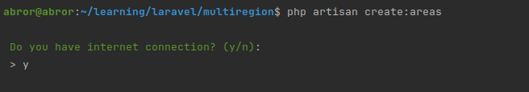

###  Создание модуля мультирегиональности

 - [x] Framework Laravel 10
 - [x] Database MySQL

 ### Первый запуск

1. Перейти в папку проекта
2. копировать .env.example в .env
3. Добавьте переменные MySQL и имя базы данных для аутентификации
4. Добавьте в .env `HH_API_URL="https://api.hh.ru/areas"` для Загрузка городов в БД

```angular2html
php artisan key:generate
php artisan migrate
php artisan serve
npm install
npm run dev
```
Команда Загрузка городов в БД
`php artisan create:areas`

- Проверьте подключение к интернету
- 
- Для выбора страны
- 
- Сообщение об успешном завершении
- 

### API
1. List method GET `api/districts`
2. Create method POST 
 ```
    url: "api/districts/create"
    body:
    {
	    "name": "test"
    }
```
3. Delete method DELETE `api/districts/{district}`
`{district}` id from `api/districts` method

